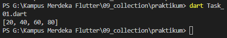
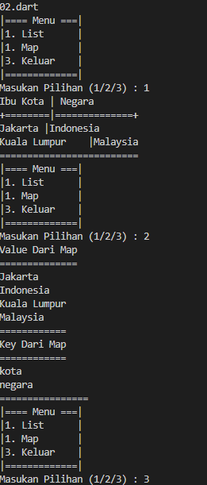

## Task 01 Buatlah sebuah fungsi dengan spesifikasi :
- menerima 2 parameter, yaitu list data dan ppengali'
- lakukan perulangan pada list secara async
- tiap perulangan, kalikan elemen list data dengan pengali
- return list baru yang berisi hasil proses diatas

saya membuat sebuah fungsi pengali dengan paramter List yang bertipe int dan sebuah parameter pengali dengan tipe int dan untuk fungsi tersebut saya buat secara asynchronous dengan tipe data Future dengan duration 3 second yang dimana hasil akhir dari hasil perkalian liat tersebut disimpan kedalam sebuah variabel list. dan ketika memanggil fungsi pengali pada fungsi main maka fungsi pengali akan diminta memasukan 2 parameter yakni parameter pertama list dan parameter kedua angka pengali. dengan kode "void main(List<String> args) async {
  pengali([10, 20, 30, 40], 2);
}

void pengali(List<int> a, int b) async {
  var hasil;
  var hasilAkhir = [];

  await Future.delayed(Duration(seconds: 1), () {
    for (var i = 0; i < a.length; i++) {
      hasil = [a[i] * b];
      hasilAkhir = hasil;
    }

    // print(hasilAkhir);
    hasilAkhir = [a[0] * b, a[1] * b, a[2] * b, a[3] * b];
    print(hasilAkhir);
  });
}"
sebagai contoh saya memasukian list [10,20,30,40] dan bilangan pengali 2 sehingga hasilnya adalah sebuah list dengan nilai [20,40,60,80] hasil :
 PS G:\Kampus Merdeka Flutter\09_collection\praktikum> dart Task_01.dart
[20, 40, 60, 80]

## Task 02 Buatlah sebuah list dengan spesifikasi :
- tiap element berupa list juga
- tiap element wajib terdapat 2 data sub
- Buatlah map dengan list tersebut 

Secara umum program di atas saya membuat sebuah list ibu kota dan di dalam list ibu kota menampung nilai list juga yang dimana nantinya value dari dari list ibu kota tersebut akan di jadikan sebuah map. saya membuat sebuah menu untuk melakuakan pengecekan value dari list dan map yang dimana menu tersebut saya lakukan perulangan dengan kondisi variabel cek bernilai true maka akan terus belakukan perulangan menu. jika inputan nya 1 makan akan melakukan pengecekan value dari list yang dibuat sebelumnya dan jika inputanya 2 maka akan melakukan pengecekan nilai value dan key dari map yang di buat bedasarkan value dari list dan jika inputan nya 3 maka akan keluar dari program atau variabel cek nya bernilai false dan selain dari inputan 1 , 2, dan 3 maka akan memunculkan pesan "Masukan Angka Dengan Benar".
kode : "void main(List<String> args) {
  var ibuKota = [
    ["Jakarta", "Indonesia"],
    ["Kuala Lumpur", "Malaysia"]
  ];
  var country = {};
  var kota;
  bool cek = true;

  while (cek == true) {
    print("|==== Menu ===|");
    print("|1. List      |");
    print("|1. Map       |");
    print("|3. Keluar    |");
    print("|=============|");

    stdout.write("Masukan Pilihan (1/2/3) : ");
    var pilihan = stdin.readLineSync();
    switch (pilihan) {
      case "1":
        print("Ibu Kota | Negara        ");
        print("+========|==============+");
        for (kota in ibuKota) {
          print("${kota[0]}\t|${kota[1]}");
        }
        print("=========================");
        break;
      case "2":
        print("Value Dari Map");
        print("==============");
        for (kota in ibuKota) {
          country['kota'] = kota[0];
          country['negara'] = kota[1];
          for (var countryValue in country.values) {
            print(countryValue);
          }
        }
        print("============");
        print("Key Dari Map");
        print("============");
        for (var countryKesy in country.keys) {
          print(countryKesy);
        }
        print("================");
        break;
      case "3":
        cek = false;
        break;
      default:
        print("Masukan Angka Dengan Benar");
    }
  }
}"

jika kode di run maka hasilnya akan seperti berikut : 
"PS G:\Kampus Merdeka Flutter> cd 09_collection
PS G:\Kampus Merdeka Flutter\09_collection\praktikum> dart Task_02.dart
|==== Menu ===|
|1. List      |
|1. Map       |
|3. Keluar    |
|=============|
Masukan Pilihan (1/2/3) : 1
Ibu Kota | Negara        
+========|==============+
Jakarta |Indonesia       
Kuala Lumpur    |Malaysia
=========================
|==== Menu ===|
|1. List      |
|1. Map       |
|3. Keluar    |
|=============|
Masukan Pilihan (1/2/3) : 2
Value Dari Map
==============
Jakarta
Indonesia
Kuala Lumpur
Malaysia
============
Key Dari Map
============
kota
negara
================
|==== Menu ===|
|1. List      |
|1. Map       |
|3. Keluar    |
|=============|
Masukan Pilihan (1/2/3) : 3"
