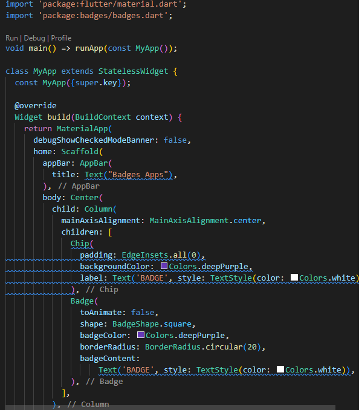
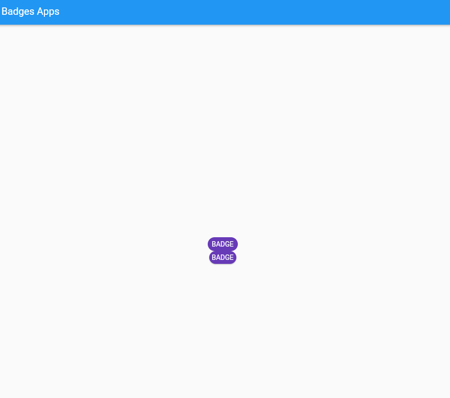
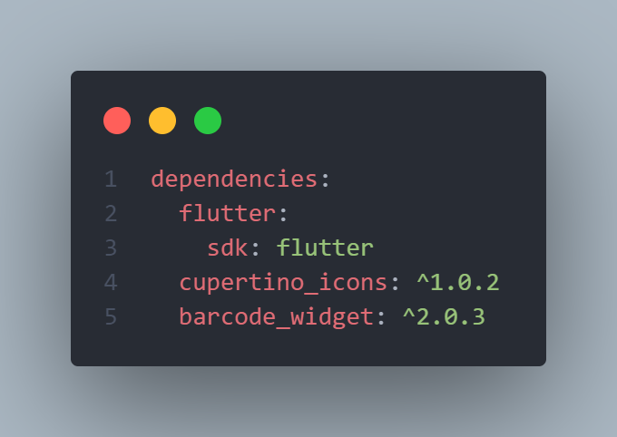
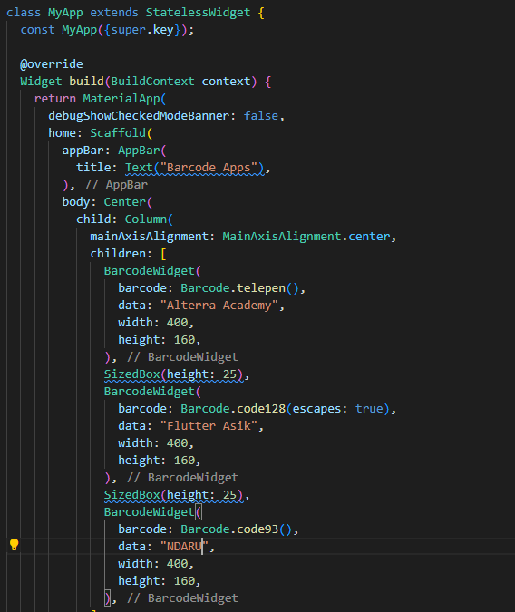
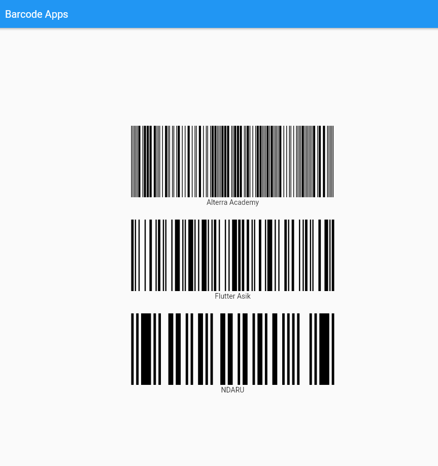

# (14) Flutter Command Line Interface (CLI) and Flutter package management

## Data Diri

| NAMA |  KELAS
|--|--|
| Ndaru Dienul Yoga Sworo  |  Flutter B

## Task
### Task 01 (Badges Apps)

Berikut code program dari badges apps :

- Dependencies
  
  Pertama tama saya menginstall packages badge dari pub.dev kedalam project di pubspec.yaml bagian dependencies.

---

- Class Main
  
  Pada class main pertama tama saya melakukan import flutter material seperti biasa dan memanggil packages badges yang sebelumnya dibuat. selanjutnya membuat stateless widget dengan material app, selanjutnya melalukan remove debug banner di aplikasi selajutnya membuat home aplikasi dengan scaffold dengan app bar (Badges Apps) kemudian membuat body dengan widget center dan di dalam widget center saya membuat sebuah widget colum dengan posisi di tengah dan pada widget colum terdapat 2 widget yaitu Chip dan Badge dimana pada widget chip memiliki padding 8 dengan background purple dengan text "BAHDGE" dengn style warna putih. dan pada widget badges memiliki properti animasi yang di nonaktifkan, shape dengan bentuk square dengan warna purple dengan radius 20 dan content text "BADGE" dengan tilisan berwarna putih.

---

- Hasil Task 01
  Berikut hasil dari task 01
  

---

### Task 02 (Barcode Apps)

Berikut code program dari barcode apps :

- Dependencies
  
  Pertama tama saya menginstall packages barcode widget dari pub.dev kedalam project di pubspec.yaml bagian dependencies.

  ***

- Class Main
  
  Pada class main pertama tama saya melakukan import flutter material seperti biasa dan memanggil packages barcode wfiget yang sebelumnya dibuat. selanjutnya membuat stateless widget dengan material app, selanjutnya melalukan remove debug banner di aplikasi selajutnya membuat home aplikasi dengan scaffold dengan app bar (Barcode Apps) kemudian membuat body dengan widget center dan di dalam widget center saya membuat sebuah widget colum dengan posisi di tengah dan pada widget colum terdapat terdapat 3 buah widget barcode yang terdiri dari :

  - barcode type telepen
    
    Pada barcode yang pertama adalah barcode dengan type telepen dengan panjang 600 dan lebar 400 dan dengan data "Alterra Academy"

    ***

- Hasil Task 02
  Berikut hasil dari task 02
  
