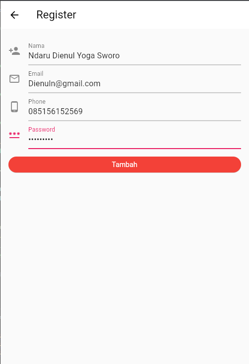
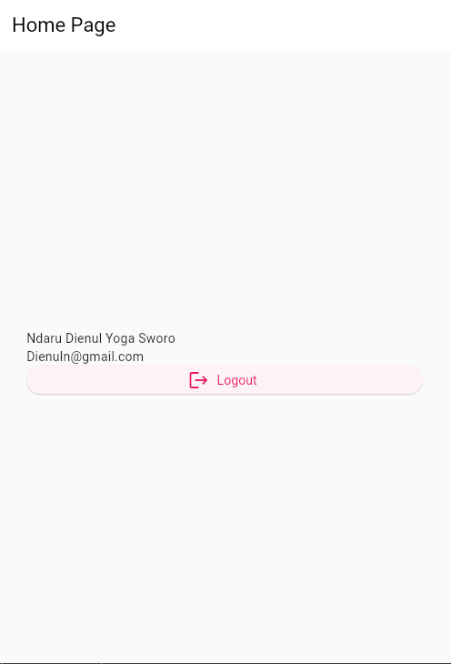

# (24) Storages

## Data Diri

| NAMA |  KELAS
|--|--|
| Ndaru Dienul Yoga Sworo  |  Flutter B

## Task

- Register Page (register_page.dart)

```
class RegisterPage extends StatefulWidget {
  static const routeName = '/register';
  const RegisterPage({super.key});

  @override
  State<RegisterPage> createState() => _RegisterPageState();
}

class _RegisterPageState extends State<RegisterPage> {
  final formKey = GlobalKey<FormState>();

  final _ctrlName = TextEditingController();
  final _ctrlEmail = TextEditingController();
  final _ctrlPhone = TextEditingController();
  final _ctrlPassword = TextEditingController();

  late SharedPreferences dataUser;
  late bool newUser;

  void checkUser() async {
    dataUser = await SharedPreferences.getInstance();
    newUser = dataUser.getBool('register') ?? true;

    if (newUser == false) {
      Navigator.pushAndRemoveUntil(
          context,
          MaterialPageRoute(
            builder: (context) => const HomePage(),
          ),
          (route) => false);
    }
  }

  @override
  void initState() {
    checkUser();
    super.initState();
  }

  @override
  void dispose() {
    _ctrlName;
    _ctrlEmail;
    _ctrlPhone;
    _ctrlPassword;
    super.dispose();
  }

  @override
  Widget build(BuildContext context) {
    return Scaffold(
      appBar: AppBar(
        title: const Text("Register"),
      ),
      body: Padding(
        padding: const EdgeInsets.all(16),
        child: Form(
          key: formKey,
          child: Column(
            crossAxisAlignment: CrossAxisAlignment.stretch,
            children: [
              TextFormField(
                decoration: const InputDecoration(
                  icon: Icon(Icons.person_add),
                  label: Text('Nama'),
                  hintText: 'Masukan Nama',
                ),
                validator: (value) {
                  if (value == null || value.length < 3) {
                    return 'Masukan Catatan Dengan Benar';
                  }
                  return null;                },
                keyboardType: TextInputType.name,
                textInputAction: TextInputAction.next,
                controller: _ctrlName,
              ),
              TextFormField(
                decoration: const InputDecoration(
                  icon: Icon(Icons.email_outlined),
                  label: Text('Email'),
                  hintText: 'Masukan Email',
                ),
                validator: (value) {
                  if (value == null || value.length < 5) {
                    return 'Masukan Email Dengan Benar';
                  }
                  return null;
                },
                keyboardType: TextInputType.emailAddress,
                textInputAction: TextInputAction.next,
                controller: _ctrlEmail,
              ),
              TextFormField(
                decoration: const InputDecoration(
                  icon: Icon(Icons.phone_android_outlined),
                  label: Text('Phone'),
                  hintText: 'Masukan Phone',
                ),
                validator: (value) {
                  if (value == null || value.length < 5) {
                    return 'Masukan Phone Dengan Benar';
                  }
                  return null;
                },
                keyboardType: TextInputType.number,
                textInputAction: TextInputAction.next,
                controller: _ctrlPhone,
              ),
              TextFormField(
                decoration: const InputDecoration(
                  icon: Icon(Icons.password_outlined),
                  label: Text('Password'),
                  hintText: 'Masukan Password',
                ),
                validator: (value) {
                  if (value == null || value.length < 5) {
                    return 'Masukan Password Dengan Benar';
                  }
                  return null;
                },
                keyboardType: TextInputType.text,
                textInputAction: TextInputAction.next,
                controller: _ctrlPassword,
              ),
              const SizedBox(height: 16),
              ElevatedButton(
                onPressed: () {
                  final isValidForm = formKey.currentState!.validate();
                  final username = _ctrlName.text;
                  final email = _ctrlEmail.text;

                  dataUser.setBool('register', false);
                  dataUser.setString('username', username);
                  dataUser.setString('email', email);
                  if (isValidForm) {
                    Navigator.pushAndRemoveUntil(
                        context,
                        MaterialPageRoute(
                          builder: (context) => const HomePage(),
                        ),
                        (route) => false);
                  }
                },
                child: const Text('Tambah'),
                style: ElevatedButton.styleFrom(
                  backgroundColor: Colors.red,
                  foregroundColor: Colors.white,
                ),
              ),
            ],
          ),
        ),
      ),
    );
  }
}

```

Pada register page sama membuat sebuah variabel dataUser dengan SharedPreferences dan sebuah variabel newUser dengan tipe bool dan 4 buat contrloller dari form yaitu controller name, email, phone, dan password dan membuat sebuah method check user dan sebuah method initsate dan dispose unutk mencegah kebocoran memory. dan saya membuat 4 buat TextFormField untuk form inputan yaitu name, email, phone, dan password. dan setiap TextFormField sudah di hubungkan kedalam controller yang sudah di buat sebelumnya. dan yang terakhir terdapat sebuah ElevatedButton dan di dalam onPressed saya membuat 2 buah variabel username dan email karena yang dikirimkan atau yang disimpan nantinya di shared preference hanya name dan email dan meembuat sebuah variabel isValidForm untuk melakukan validasi terhadap form apakah form sudah berisi inputan yang benar atau tidak lalu jika TextFormField sudah sesuai maka akan di push ke home page dengan Navigator.pushAndRemoveUntil

- Home Page (home_page.dart)

```
class HomePage extends StatefulWidget {
  static const routeName = '/home';
  const HomePage({super.key});

  @override
  State<HomePage> createState() => _HomePageState();
}

class _HomePageState extends State<HomePage> {
  late SharedPreferences dataUser;
  String name = "";
  String email = "";

  void initial() async {
    dataUser = await SharedPreferences.getInstance();
    setState(() {
      name = dataUser.getString("username") ?? "";
      email = dataUser.getString("email") ?? "";
    });
  }

  @override
  void initState() {
    super.initState();
    initial();
  }

  @override
  Widget build(BuildContext context) {
    return Scaffold(
      appBar: AppBar(
        title: const Text("Home Page"),
      ),
      body: Center(
        child: Padding(
          padding: const EdgeInsets.all(32),
          child: Column(
            crossAxisAlignment: CrossAxisAlignment.stretch,
            mainAxisAlignment: MainAxisAlignment.center,
            children: [
              const SizedBox(height: 10),
              Text(name),
              Text(email),
              ElevatedButton.icon(
                onPressed: () {
                  dataUser.setBool("register", true);
                  dataUser.remove("username");
                  Navigator.pushAndRemoveUntil(
                      context,
                      MaterialPageRoute(
                        builder: (context) => const RegisterPage(),
                      ),
                      (route) => false);
                },
                icon: const Icon(Icons.logout),
                label: const Text("Logout"),
              ),
            ],
          ),
        ),
      ),
    );
  }
}

```

Di Home Page pada bagian state saya memanggil SharedPreferences dengan nama dataUser dan saya membuat 2 buat variabel name dan email untuk menerima data dari register yang selanjutnya saya membuat method initial dengan async await dan dalam initial saya membuat variabel dataUser denga SharedPreferences.getInstance() dan melakuakn set state name dan email dari data user yang dibuat tadi lalu saya membuat sebuah method initState dan pada halaman home page ini saya mereturn scaffold dengan body center dan dengan child column dan pada column saya menampilkan text dari name dan email yang dikirmkan dari halaman register dan sebuah ElevatedButton untuk menghapus data name dan email tersebut.

- Hasil
  
  

Jika dilakukan restart maka data nama dan email masih tersimpan, dan jika tombol logout di klik maka akan menghapus data tersebut.