# Tugas Praktikum – Basic Version and Branch Management (Git)

| NAMA |  KELAS
|--|--|
| Ndaru Dienul Yoga Sworo  |  Flutter B

## 1. Buat Sebuah Repository GIthub 

> Create Repositories

   
> Stock Repositories
   

## 2. Implementasikan penggunaan branching yang terdiri dari master, development, featureA, dan featureB :

> Create Branch Development

> Create Branch featureA

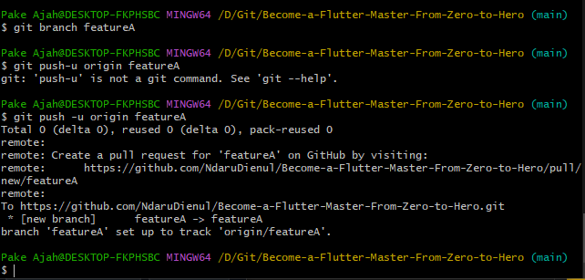

> Create Branch featureB

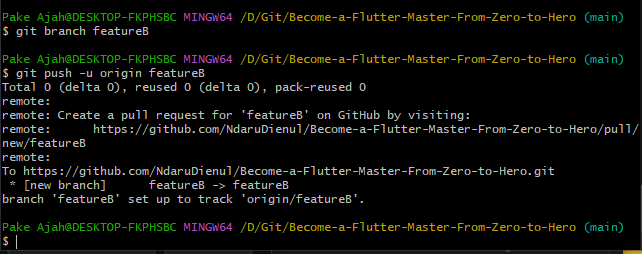

> Branch List

> Branch Preview In Repositories

## 3. Implementasikan intruksi git untuk push, pull, stash dan merge

> Push

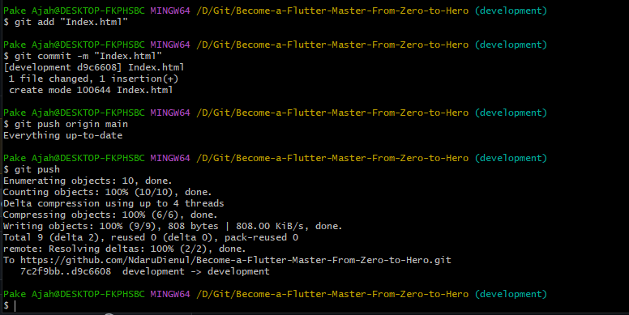

> Pull 

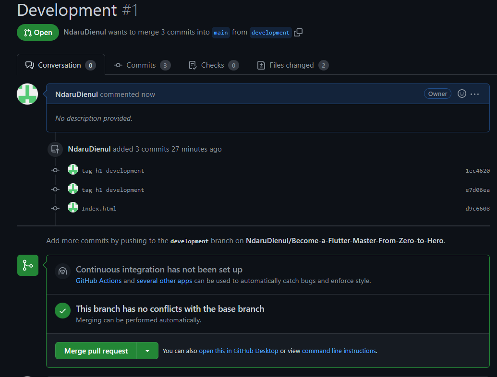

> Stash

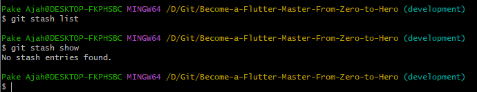

> Merge

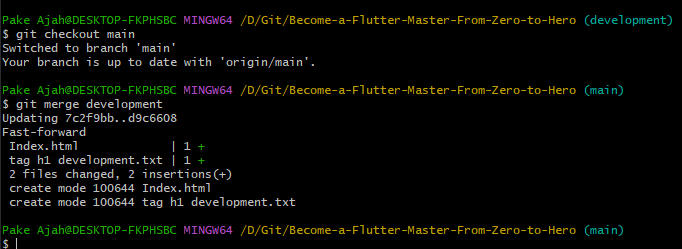

## 4. Implementasikan sebuah penanganan conflict di branch developement ketika setelah merge dari branch featureA lalu merge dari branch featureB (Conflict bisa terjadi jika kedua branch mengerjakan di file dan line code yang sama) : 

> Conflict

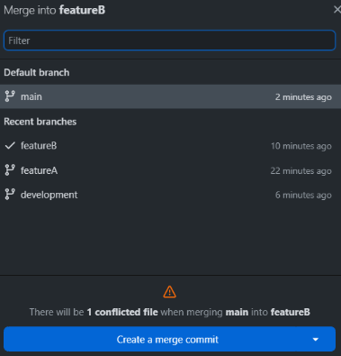

> Conflict View

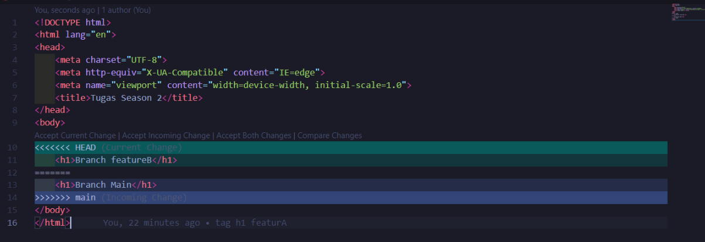

> Conflict Solution

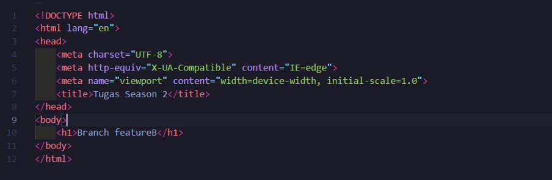

> Conflict Done

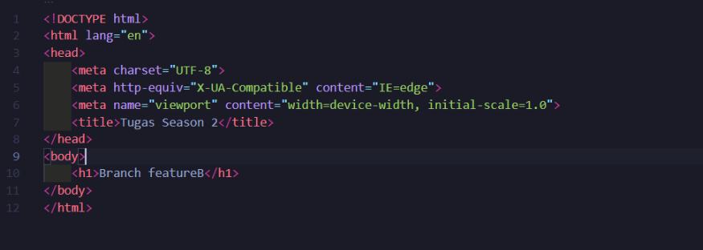

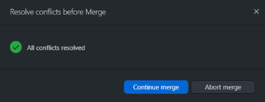

## Gunakan merge no fast forward

> Merge No Fast Forward

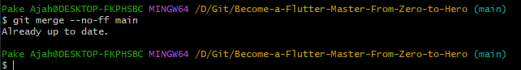

